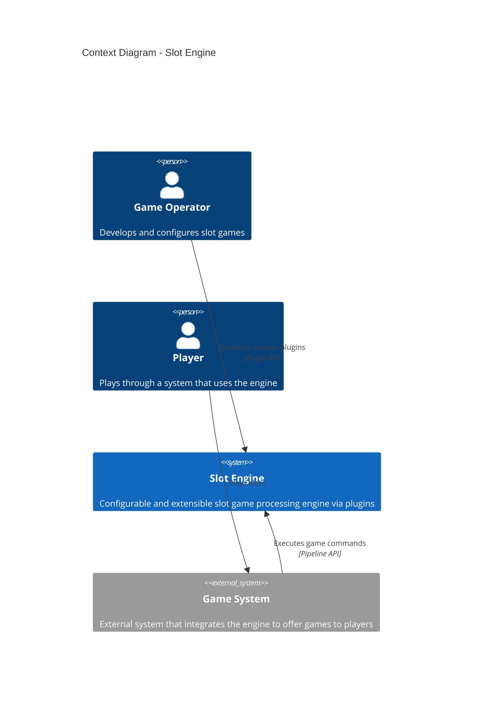
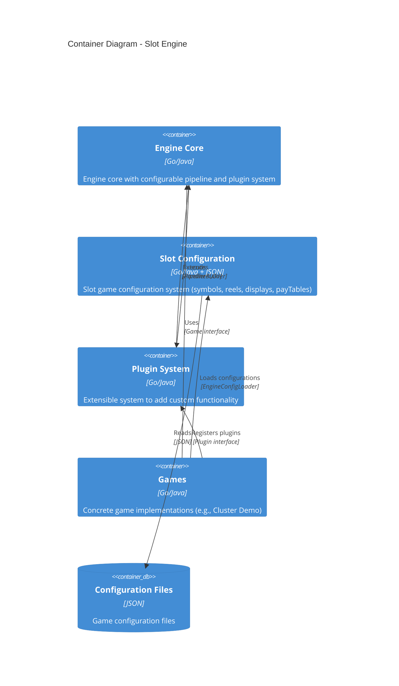
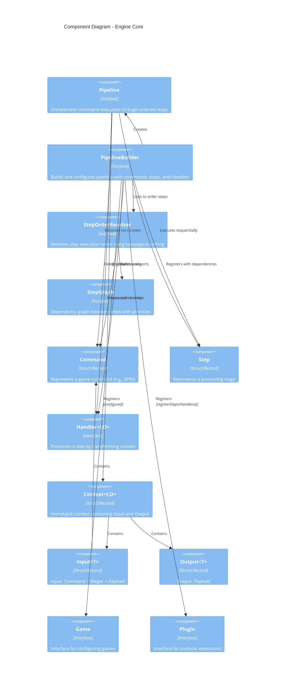
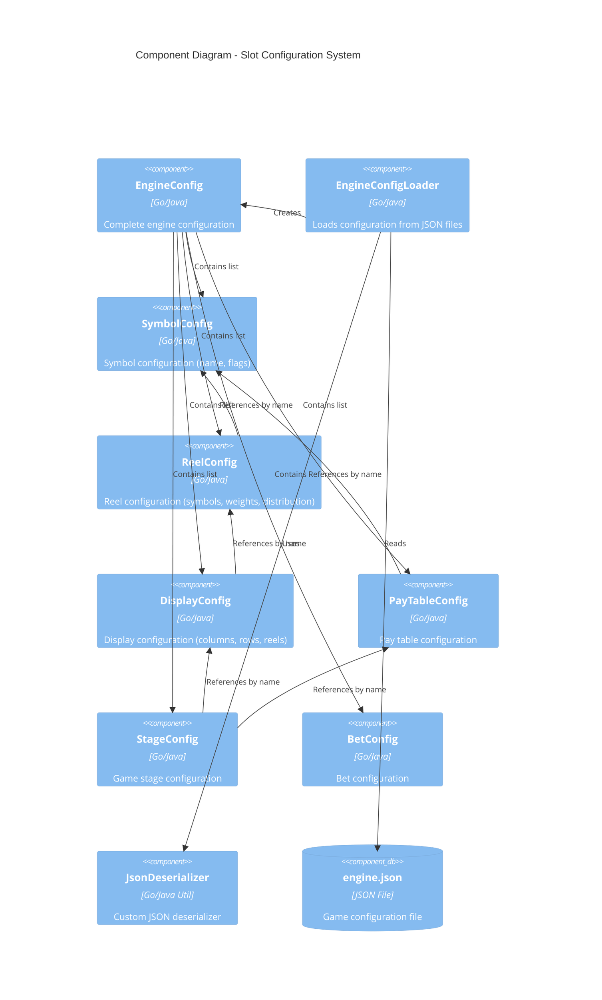
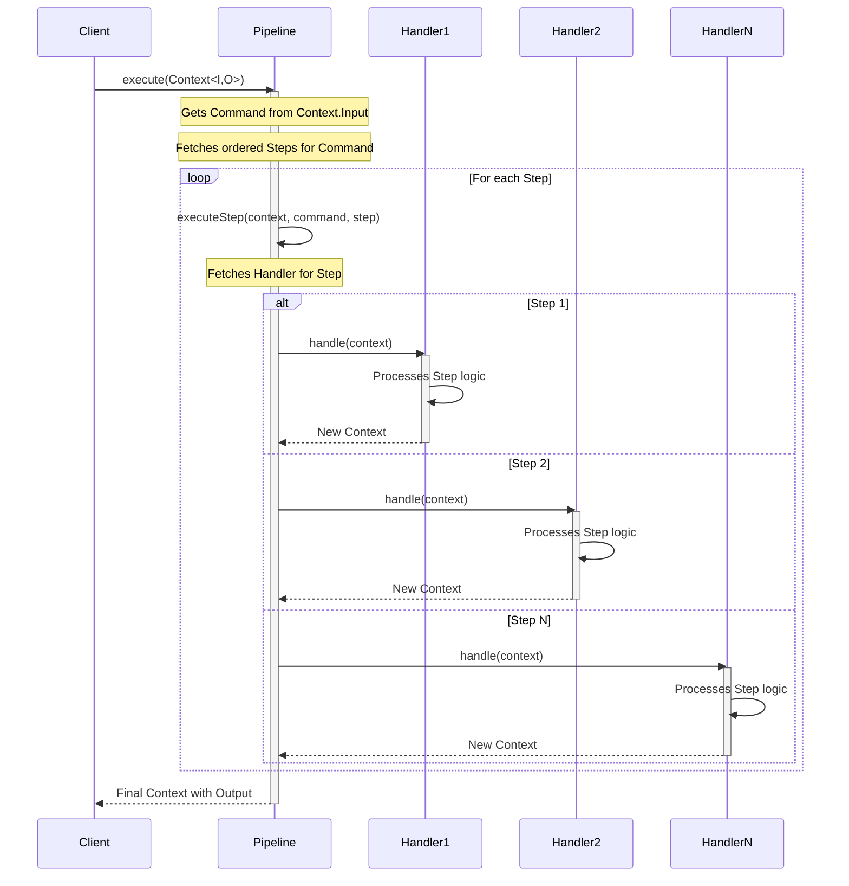
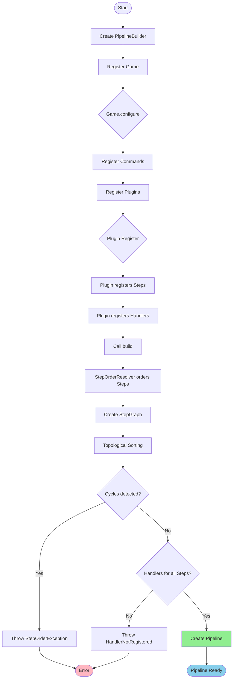
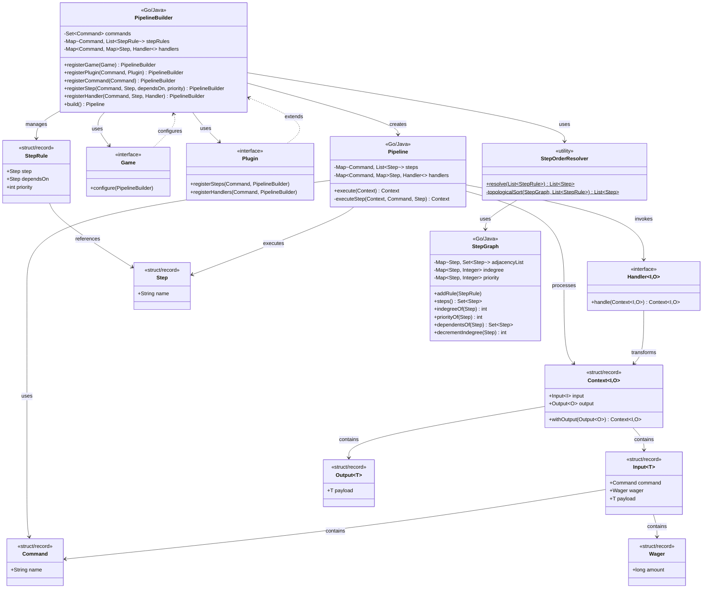

# C4 Diagrams - Slot Engine

This document contains the C4 architecture diagrams for the Slot Engine using Mermaid.

## Level 1: Context Diagram

Shows the system and its external users.

## Level 2: Container Diagram

Shows the main containers and modules of the system.

## Level 3: Component Diagram - Engine Core

Shows the internal components of the engine core.

## Level 3: Component Diagram - Slot Configuration

Shows the components of the slot configuration system.

## Sequence Diagram - Pipeline Execution

Shows the execution flow of a command through the pipeline.

## Flow Diagram - Pipeline Construction

Shows how the pipeline is built and configured.

## Class Diagram - Core Domain Model

Shows the main classes and their relationships.

## Architectural Patterns Identified

### 1. **Pipeline Pattern**

- Sequential processing through stages (Steps)
- Each Handler transforms the Context
- Context immutability (records/structs)

### 2. **Command Pattern**

- Commands represent game actions (SPIN, etc.)
- Decoupling between request and execution

### 3. **Strategy Pattern**

- Handlers are interchangeable strategies
- Handler<I,O> interface allows different implementations

### 4. **Builder Pattern**

- PipelineBuilder for fluent construction
- Validation at build() stage

### 5. **Plugin Architecture**

- Extensible system via Plugin interface
- Dynamic registration of Steps and Handlers

### 6. **Dependency Injection**

- Handlers are injected into Pipeline via Builder
- Plugins configure dependencies

### 7. **Topological Sorting**

- Step ordering based on dependencies
- Cycle detection with StepGraph

### 8. **Immutable Domain Model**

- Records/Structs for Command, Step, Context, Input, Output
- Thread-safe security

## Technical Characteristics

### Extensibility

- ✅ Plugin system allows adding functionality
- ✅ Customizable Handlers per Step
- ✅ External configuration via JSON

### Configurability

- ✅ Steps ordered by dependencies and priorities
- ✅ Multiple Commands supported
- ✅ Complete slot configuration system

### Safety

- ✅ Immutability via records/structs
- ✅ Defensive copying in Pipeline
- ✅ Build-time validation

### Maintainability

- ✅ Clear separation of concerns
- ✅ Specific exceptions for each error
- ✅ Strongly typed code

### Performance

- ✅ Shareable immutable structures
- ✅ Efficient topological sorting (O(V+E))
- ✅ Maps for fast Handler access
